# Hi, I'm Dharania

I'm a data-focused developer who turns raw information into clear insights, smart models, and practical digital products. I enjoy working where data science, analytics, AI, and full-stack development meet.

## What I Work With

- **Data Science:** cleaning, exploring, modeling, and explaining data with Python
- **Data Analytics:** dashboards, KPI tracking, storytelling, and insight-driven reporting
- **AI/ML:** machine learning, deep learning, experimentation, and intelligent app features
- **Business Intelligence:** Power BI and Tableau dashboards for clear decision-making
- **Web Development:** responsive interfaces, APIs, and full-stack applications with React, Django, and Flask

## Tech Stack

## Current Focus

- Building data-driven applications that make complex information easier to use
- Designing dashboards that turn metrics into decisions with Power BI and Tableau
- Training and evaluating ML/deep learning models with Python libraries
- Connecting analytics, models, and web apps into polished end-to-end projects

## GitHub Snapshot

  

## Connect

- GitHub: `https://github.com/dharaniathananchayan`
- LinkedIn: `https://linkedin.com/in/YOUR_LINKEDIN_USERNAME`
- Email: `your.email@example.com`

---

Thanks for visiting my profile.
